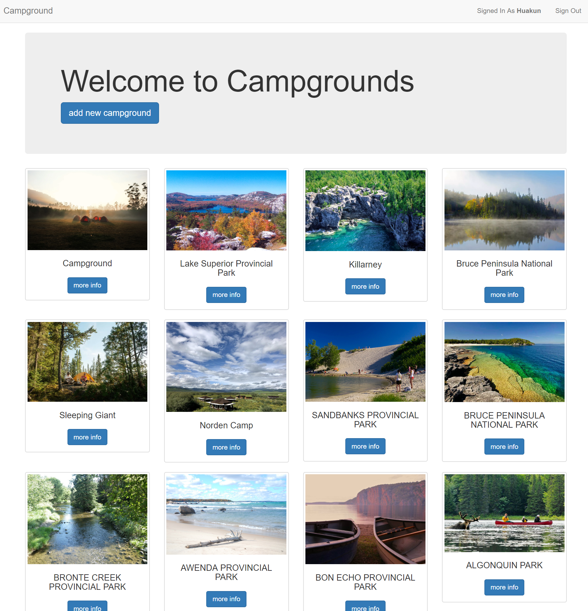
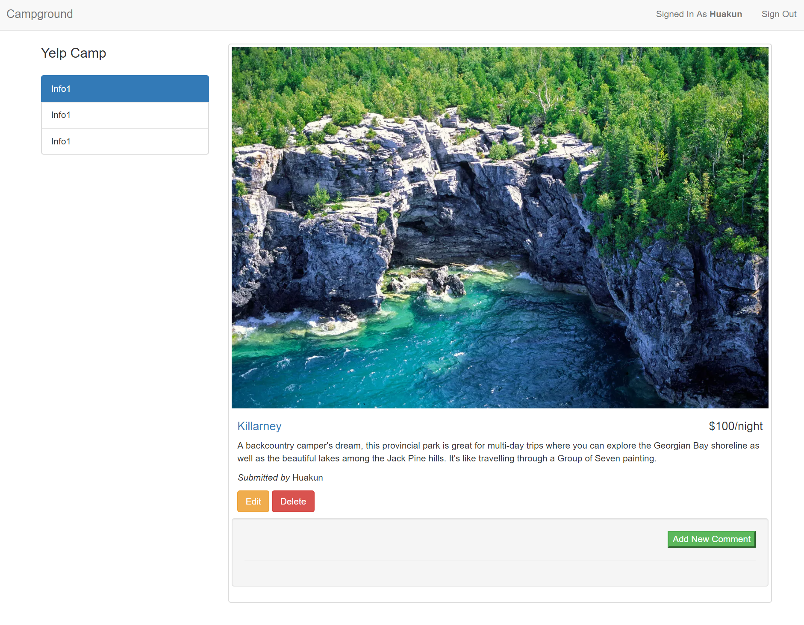
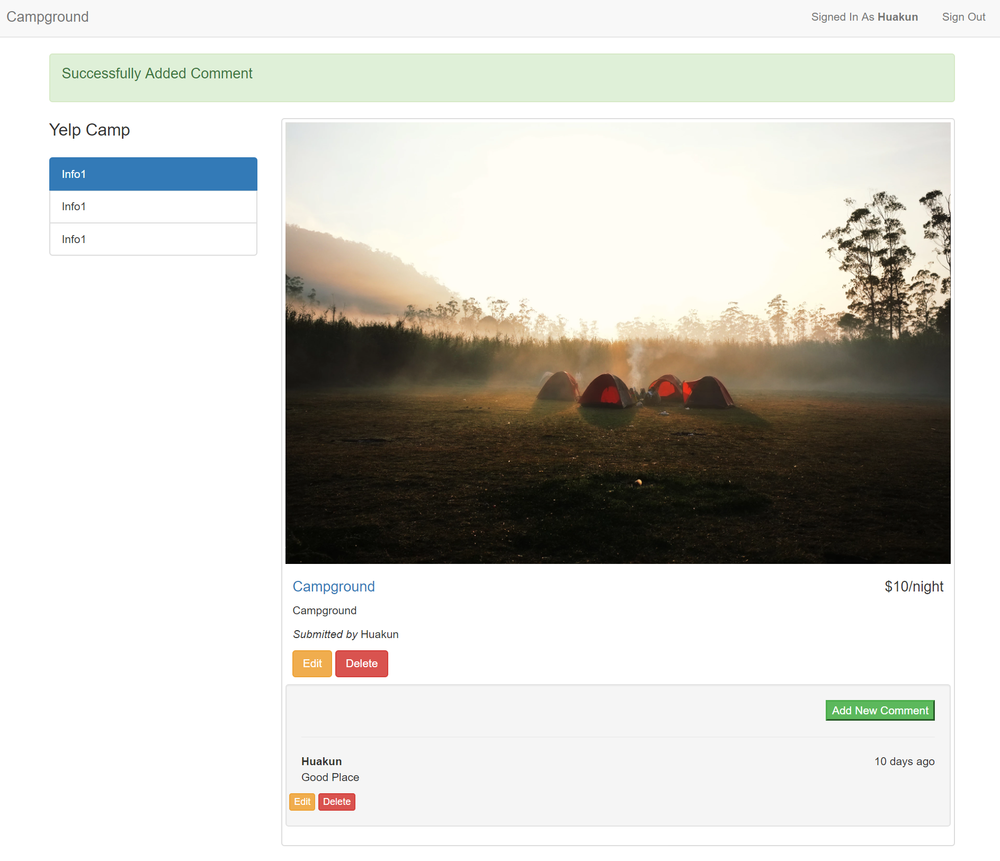
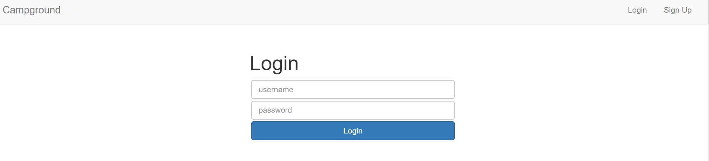
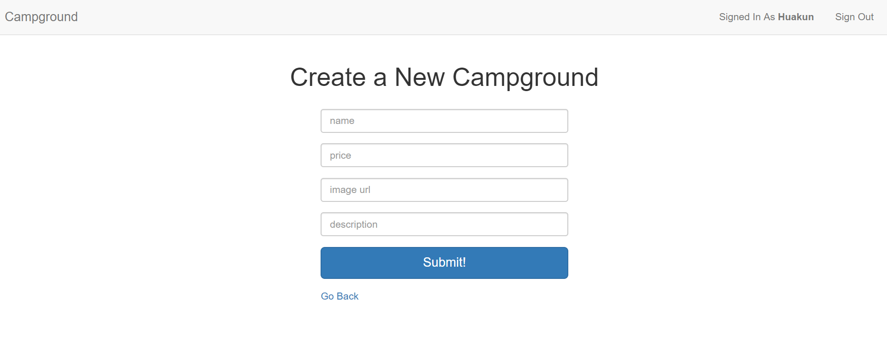

# Campground App

## Description

This is a practice web development app, displaying campground image and information.

## Purpose

* Practice using MongoDB
* Learn Authentication based on MongoDB and `passport` package

## Features

* **Authentication:** Sign In, Sign Up and Sign Out feature based on MongoDB, and `passport, passport-local` `npm` packages
* User could add a campground (post) to the website if user is signed in. Otherwise, user will be prompt to sign in.
* User could add **name**, **price**, **image**(image URL), **description** to a campground. All information are stored in MongoDB Atlas.
* In `Description Page` of each campground, every signed in user could add comment.
* If signed in, user could also modify the posts and comments the user created. (A user doesn't have permission to modify other user's posts or comments)

## Dependency

also included in `package.json`, install by running `npm install`

### Main Dependencies

* **MongoDB Atlas**
* **Mongoose**
* passport
* passport-local
* flash

## Todo

* Google Map Integration to `More Info` Page

## To Run Locally

1. Add a `password.js`

   ```js
   exports.mongodb_pwd = 'your_password';
   // The password you should enter is the password to your cluster on MongoDB Atlas
   ```

2. Run `node app.js` in the root directory of the repo.

3. Open Browser and go to `localhost:4000`










